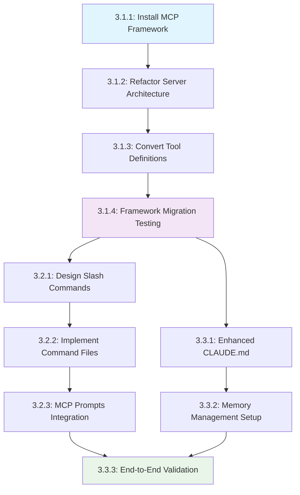

# Phase 3 Preparation: Standards Alignment & Claude Code Optimization
*Strategy Library MCP Server - Framework Migration & Integration Enhancement*  
*Date: 2025-06-21 | Generated via Motor de Estrategias Dogfooding*  
*Task: "Implement Phase 3: Standards Alignment & Claude Code Optimization"*

---

## 📋 `user_facing` - Strategic Plan Summary

### **Summary**
Phase 3 transforms our functional Motor de Estrategias MCP server into a **standards-compliant, Claude Code-optimized strategic planning platform**. This phase migrates from manual stdio implementation to the official MCP framework, implements custom slash commands, and optimizes Claude Code integration through enhanced CLAUDE.md configuration.

### **Key Points**
- 🔧 **Framework Migration**: Migrate to official `mcp.server.fastmcp.FastMCP` for standards compliance and maintainability
- ⚡ **Slash Commands**: Implement `/project:architect-plan`, `/project:architect-continue`, `/project:architect-analyze` for streamlined UX
- 📝 **CLAUDE.md Optimization**: Enhanced project instructions with structured tool usage patterns and context guidance
- ✅ **100% Standards Compliance**: Full alignment with MCP specifications and Claude Code best practices
- 🚀 **Enhanced User Experience**: Simplified tool discovery and usage through native Claude Code integrations

### **Implementation Timeline**

```mermaid
gantt
    title Phase 3: Standards Alignment & Claude Code Optimization
    dateFormat  HH:mm
    axisFormat  %H:%M
    
    section Phase 3.1 Framework Migration
    Install MCP Dependencies      :milestone, m1, 09:00, 0m
    Refactor Server Architecture  :active, 3-1a, 09:00, 45m
    Convert Tool Definitions      :3-1b, after 3-1a, 30m
    Validation & Testing          :3-1c, after 3-1b, 15m
    
    section Phase 3.2 Commands & Prompts
    Design Slash Commands         :3-2a, after 3-1c, 20m
    Implement Command Files       :3-2b, after 3-2a, 25m
    MCP Prompts Integration       :3-2c, after 3-2b, 15m
    
    section Phase 3.3 Integration Optimization
    Enhanced CLAUDE.md            :3-3a, after 3-1c, 20m
    Memory Management Setup       :3-3b, after 3-3a, 10m
    
    section Validation
    End-to-End Testing           :milestone, m2, after 3-2c, 0m
```



### **Next Steps**
1. Execute Phase 3.1: Framework Migration (90 minutes)
2. Execute Phase 3.2: Commands & Prompts Implementation (60 minutes)  
3. Execute Phase 3.3: Integration Optimization (30 minutes)
4. Comprehensive validation and deployment testing

---

## ⚙️ `claude_instructions` - Execution Framework

### **Execution Type**: `multi_step`

### **Actions**

#### **Action 3.1.1: Install Official MCP Framework**
- **Type**: `dependency_management`
- **Description**: Install official MCP Python framework and update project dependencies
- **Priority**: 1
- **Validation Criteria**: `poetry add mcp` executes successfully and `mcp.server.fastmcp` imports without errors
- **Parameters**: 
  ```json
  {
    "package": "mcp",
    "version": ">=1.2.0",
    "update_pyproject": true
  }
  ```

#### **Action 3.1.2: Refactor Server Architecture**
- **Type**: `framework_migration`  
- **Description**: Migrate `server.py` from manual stdio to official FastMCP framework
- **Priority**: 2
- **Validation Criteria**: Server instantiates using FastMCP, maintains all existing functionality, and passes integration tests
- **Parameters**:
  ```json
  {
    "source_file": "server.py",
    "target_pattern": "fastmcp_decorator",
    "preserve_functionality": true
  }
  ```

#### **Action 3.1.3: Convert Tool Definitions** 
- **Type**: `tool_enhancement`
- **Description**: Convert strategy-architect tool to use MCP decorator pattern with proper JSON Schema
- **Priority**: 3
- **Validation Criteria**: Tool uses `@mcp.tool()` decorator, includes complete `inputSchema`, and maintains StrategyResponse output format
- **Parameters**:
  ```json
  {
    "tool_name": "strategy-architect",
    "schema_compliance": "full",
    "type_hints": "required"
  }
  ```

#### **Action 3.1.4: Framework Migration Testing**
- **Type**: `integration_validation`
- **Description**: Verify migrated server maintains all Phase 2.5 functionality
- **Priority**: 4  
- **Validation Criteria**: All existing integration tests pass, response schemas remain valid, and performance metrics are maintained
- **Parameters**:
  ```json
  {
    "test_suite": "tests/test_integration.py::TestMotorDeEstrategiasIntegration",
    "performance_baseline": "1.5_seconds_max"
  }
  ```

#### **Action 3.2.1: Design Slash Command Architecture**
- **Type**: `command_design`
- **Description**: Create slash command specifications following Claude Code best practices
- **Priority**: 5
- **Validation Criteria**: Command specifications validate against Claude Code schema and follow official naming conventions
- **Parameters**:
  ```json
  {
    "commands": ["architect-plan", "architect-continue", "architect-analyze"],
    "location": ".claude/commands/",
    "format": "markdown_with_yaml_frontmatter"
  }
  ```

#### **Action 3.2.2: Implement Command Files**
- **Type**: `command_implementation`
- **Description**: Create .claude/commands/ directory structure with command definitions
- **Priority**: 6
- **Validation Criteria**: Commands are discoverable via Claude Code, accept arguments correctly, and invoke strategy-architect tool properly
- **Parameters**:
  ```json
  {
    "command_template": "yaml_frontmatter + markdown_body",
    "argument_handling": "$ARGUMENTS placeholder",
    "tool_integration": "strategy-architect"
  }
  ```

#### **Action 3.2.3: MCP Prompts Integration**
- **Type**: `prompt_implementation`
- **Description**: Implement MCP Prompts for workflow-guided strategic planning
- **Priority**: 7
- **Validation Criteria**: Prompts are accessible via MCP protocol and provide structured workflow templates
- **Parameters**:
  ```json
  {
    "prompt_types": ["strategic_planning", "workflow_continuation", "quick_analysis"],
    "template_support": true,
    "resource_integration": true
  }
  ```

#### **Action 3.3.1: Enhanced CLAUDE.md Creation**
- **Type**: `memory_optimization` 
- **Description**: Create comprehensive CLAUDE.md with structured tool usage guidance
- **Priority**: 8
- **Validation Criteria**: CLAUDE.md provides clear, specific instructions for strategy-architect usage and follows Claude Code memory best practices
- **Parameters**:
  ```json
  {
    "sections": ["tool_usage_patterns", "context_guidelines", "workflow_examples"],
    "specificity_level": "high",
    "example_scenarios": true
  }
  ```

#### **Action 3.3.2: Memory Management Setup**
- **Type**: `memory_configuration`
- **Description**: Configure modular memory imports and optimization patterns
- **Priority**: 9
- **Validation Criteria**: Memory files are properly organized, imports work correctly, and Claude Code recognizes all configurations
- **Parameters**:
  ```json
  {
    "import_structure": "modular",
    "max_import_depth": 3,
    "memory_scope": "project"
  }
  ```

#### **Action 3.3.3: End-to-End Validation**
- **Type**: `comprehensive_testing`
- **Description**: Validate complete Phase 3 implementation with real Claude Code integration
- **Priority**: 10
- **Validation Criteria**: All slash commands work, MCP server responds correctly, and strategic planning workflows execute successfully via Claude Code
- **Parameters**:
  ```json
  {
    "test_scenarios": ["new_project_planning", "workflow_continuation", "single_phase_analysis"],
    "claude_code_integration": true,
    "performance_validation": true
  }
  ```

### **Context Requirements**
- **Required Tools**: ["poetry", "pytest", "mypy", "claude-code-cli"]
- **Required Info**: ["MCP framework documentation", "Claude Code slash command examples", "Phase 2.5 functionality baseline"]

---

## 🧬 `payload` - Implementation Architecture

### **Task Graph - Dependencies & Execution Flow**



### **Critical Path Analysis**
**Critical Path**: 3.1.1 → 3.1.2 → 3.1.3 → 3.1.4 → 3.2.1 → 3.2.2 → 3.2.3 → 3.3.3  
**Total Duration**: 180 minutes (3 hours)  
**Parallel Opportunities**: CLAUDE.md optimization (3.3.1, 3.3.2) can run parallel to command implementation

### **Resource Assignments**
- **Framework Migration (3.1.x)**: Senior Developer (high technical complexity)
- **Commands & Prompts (3.2.x)**: Full-stack Developer (UX + technical integration)  
- **Integration Optimization (3.3.x)**: Technical Writer + Developer (documentation + configuration)

### **Risk Mitigation**
- **Framework Migration Risk**: Maintain backward compatibility, comprehensive testing at each step
- **Integration Risk**: Validate each component independently before end-to-end testing
- **Performance Risk**: Benchmark before/after migration to ensure no regressions

### **Suggested Next State**
```json
{
  "workflow_stage": "framework_migration",
  "current_phase": "3.1",
  "context_to_maintain": {
    "phase_2_5_baseline": "all_tests_passing",
    "performance_target": "sub_1_5_second_response",
    "compatibility_requirement": "zero_breaking_changes"
  },
  "next_milestone": "mcp_framework_operational",
  "validation_checkpoints": [
    "dependency_installation_success",
    "server_refactor_complete", 
    "tool_conversion_complete",
    "migration_testing_passed"
  ]
}
```

---

## 📊 `metadata` - Strategic Assessment

### **Confidence Score**: `0.85`
**Rationale**: High confidence based on thorough research of official documentation, proven Phase 2.5 foundation, and incremental approach that preserves existing functionality while adding standards compliance.

### **Complexity Score**: `7/10`
**Rationale**: Framework migration involves significant architectural changes, but well-documented patterns and incremental approach reduce risk. MCP framework provides clear migration path.

### **Estimated Duration**: `3 hours (180 minutes)`
**Breakdown**:
- Framework Migration: 90 minutes (50%)
- Commands & Prompts: 60 minutes (33%)  
- Integration Optimization: 30 minutes (17%)

### **Performance Hints**
- Execute framework migration first to establish solid foundation
- Test each component independently before integration
- Use parallel development for commands and CLAUDE.md optimization
- Maintain comprehensive test coverage throughout migration

### **Learning Opportunities**
- **MCP Framework Mastery**: Deep understanding of official MCP patterns and best practices
- **Claude Code Integration**: Advanced slash command and memory management techniques  
- **Standards Compliance**: Experience with protocol compliance and framework migration
- **Dogfooding Methodology**: Using strategic planning tools to plan their own evolution

### **Success Metrics**
- ✅ **100% MCP Standards Compliance**: All tools follow official patterns
- ✅ **Enhanced User Experience**: Slash commands provide streamlined access
- ✅ **Maintained Performance**: <1.5 second response times preserved
- ✅ **Zero Regressions**: All Phase 2.5 functionality preserved
- ✅ **Framework Benefits**: Reduced maintenance overhead via official framework

---

## 🚀 **Strategic Impact Assessment**

### **Transformation Value**
**From**: Functional but manually-implemented MCP server  
**To**: Standards-compliant, Claude Code-optimized strategic planning platform

### **Competitive Advantages**
1. **Standards Compliance**: Full alignment with official MCP specifications
2. **Native Integration**: Seamless Claude Code experience via slash commands
3. **Maintainability**: Official framework reduces technical debt
4. **Extensibility**: Solid foundation for future enhancements

### **Post-Phase 3 Capabilities**
- Production-ready MCP server with official framework backing
- Native Claude Code integration via custom slash commands  
- Enhanced user experience through structured memory management
- Solid foundation for advanced features (visualization, learning, optimization)

---

**🎯 Phase 3 represents the transformation of Motor de Estrategias from a functional prototype to a world-class, standards-compliant strategic planning platform fully integrated with Claude Code's native capabilities.**

*Generated via Motor de Estrategias v2.5.0 - Dogfooding Methodology Applied*  
*Ready for Implementation: Framework Migration → Commands & Prompts → Integration Optimization*